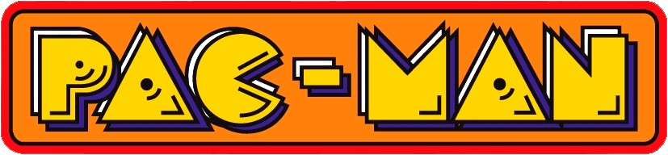

_This project has been created as part of the 42 curriculum by marberge , gchmilew._

<div align="center">
<br>
  

  <br>
</div>

# Pac Man

<div align="center">


	
	
	<br>
	

	
	
	

</div>

<div align="center">
	<br>
	<br>
	<br>
	  
	<br>
	<br>

  <br>
</div>

## I. Description

### Goal

The goal of this project is to recreate the classic arcade game Pac-Man. The player must navigate a maze, eat all the small dots (pac-gums) to complete the level, and avoid the ghosts. Eating a fruit (super pac-gum) makes the ghosts temporarily vulnerable and edible.

### Overview

The project features a fully playable game loop, score tracking, a decrementing timer, multiple randomly generated levels with increasing difficulty, and a cheat mode for evaluation. It uses `pygame` for the graphical interface and `pydantic` for strict configuration validation.

<br>
<br>

## II. Instructions

### Prerequisites
In order to run this project, ensure you have the following installed on your system:
- **Python 3.10+**
- **uv 0.10.12+**

### Quick Start
To set up the environment and run the project for the first time, simply use the following command in your terminal:

	make run

### Makefile Commands Reference
This project is fully automated using Make. Here is the complete list of available commands to manage the project lifecycle:

**Installation & Setup**
- ```make install``` (or **make all**): Initializes the virtual environment (.venv) and synchronizes all dependencies using uv.
- ```make setup```: Checks your Python version and presence of the uv package manager. Exit if both check are not valid.

**Execution & Debugging**
- ```make run```: Executes the main entry point (pac-man.py) inside the isolated virtual environment.
- ```make debug```: Launches the project using the Python Debugger (pdb), allowing you to step through your code line by line.

**Quality & Testing**
- ```make lint```: Runs flake8 for style checking and mypy for static type checking to ensure code quality.

**Building & Cleaning**
- ```make build```: Packages the project into distributable files inside a dist/ directory.
- ```make clean```: Removes all temporary files, such as __pycache__ folders and linter caches.
- ```make fclean```: Performs a deep clean. It executes the clean rule and also removes the virtual environment and build files.
- ```make re```: Rebuilds the project from scratch by running fclean followed by all.

<br>
<br>

***

## III. About this project

### Configuration
The game can be fully customized using the `config.json` file. The structure is validated using Pydantic in `src/utils/parsing.py`. 
Default values include: 
- `lives`: 3
- `points_per_pacgum`: 10
- `points_per_super_pacgum`: 50
- `points_per_ghost`: 200
- `level_max_time`: 90 seconds. 

It also stores settings for up to 10 dynamically generated levels, each with randomly assigned width, height, pacgum count, and maze generation seed. If the file is missing or corrupted, the game safely falls back to these default values.

### Highscore
The highscore system records the best performances in a JSON file (`highscore.json`). Implemented in `src/utils/highscore.py`, it uses Pydantic to strictly validate the score structure: the player name must match the regex `^[a-zA-Z0-9 ]+$` and be under 10 characters, and the score must be between 0 and 999999999. We decided to implement it this way because this robust approach prevents file corruption, avoids crashes from manual file edits, and ensures fair competition by gracefully discarding invalid entries.


### Maze Generation
The maze layouts are not hardcoded. Instead, we use the `mazegenerator` package from a previous 42 project (`A-Maze-ing`). 
In `src/core/maze.py`, the `MazeGenerator` generates a grid encoded in bitmasks. We parse these bitmasks into `Cell` objects to determine North, East, South, and West walls. The maze then gets automatically populated with super-pacgums in the corners and randomly scattered pacgums across available cells.


### Implementation
Key technical highlights of our implementation include:
- **Custom Build System:** A fully automated Makefile managing virtual environments (via `uv`), linting (`flake8`, `mypy`) and executable packaging (`PyInstaller`).
- **Cheat Mode:** A developer cheat system (F1-F5) to toggle god mode, freeze ghosts, skip levels, add lives, and boost speed for easy grading and debugging.
- **Data Validation:** Extensive use of `Pydantic` to ensure that data read from external JSON files (configuration and highscores) is strictly validated and safe.


### General Software Architecture
The software follows a modular **MVC (Model-View-Controller)** pattern:
- **Model (`GameEngine`, `Maze`, `Player`, `Ghost`)**: Holds the game state, handles collision detection, scoring, and tick-based timeline logic.
- **View (`MenuView`, `GameView`, `HighScoreView`...)**: Responsible for rendering the sprites and UI components to the screen using `pygame`.
- **Controller (`InputManager`, `CheatManager`)**: Intercepts user inputs from the keyboard and translates them into actionable game commands.

### Project Management

We worked as a team of two using an Agile-inspired approach. We used **Trello** to create and track tickets for features, refactoring, and bug fixes. To ensure constant synchronization, we held **daily stand-up meetings** every morning to plan the day, and evening wrap-ups to review progress. You can learn more about our project management at [documentation/management.md](documentation/management.md).


<br>
<br>

***

## IV. Resources

### Classic References
- [Pygame Documentation](https://www.pygame.org/docs/) - For rendering and event handling.
- [Pydantic Documentation](https://docs.pydantic.dev/) - For robust data validation.
- [The Pac-Man Dossier](https://pacman.holenet.info/) - Reference for classic Pac-Man ghost behavior and game mechanics.

### AI Usage
- **AI Assistant**: Used extensively as a pair-programming partner throughout the project. AI was specifically used to assist in setting up the complex `PyInstaller` packaging configuration, resolving Python `sys.path` and import module issues after structural refactoring, implementing the cheat code manager and its UI updates, and generating the rules view. It was also used to help draft and review parts of this documentation.