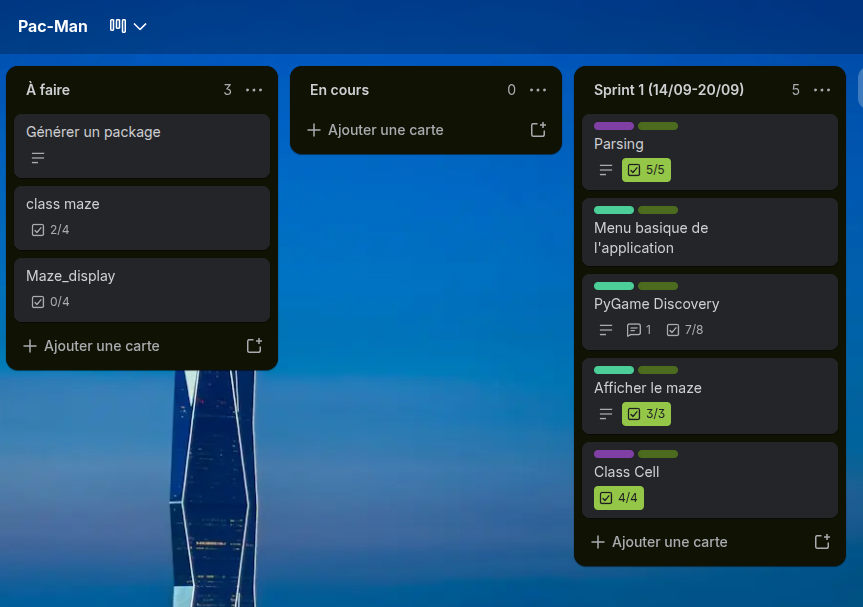
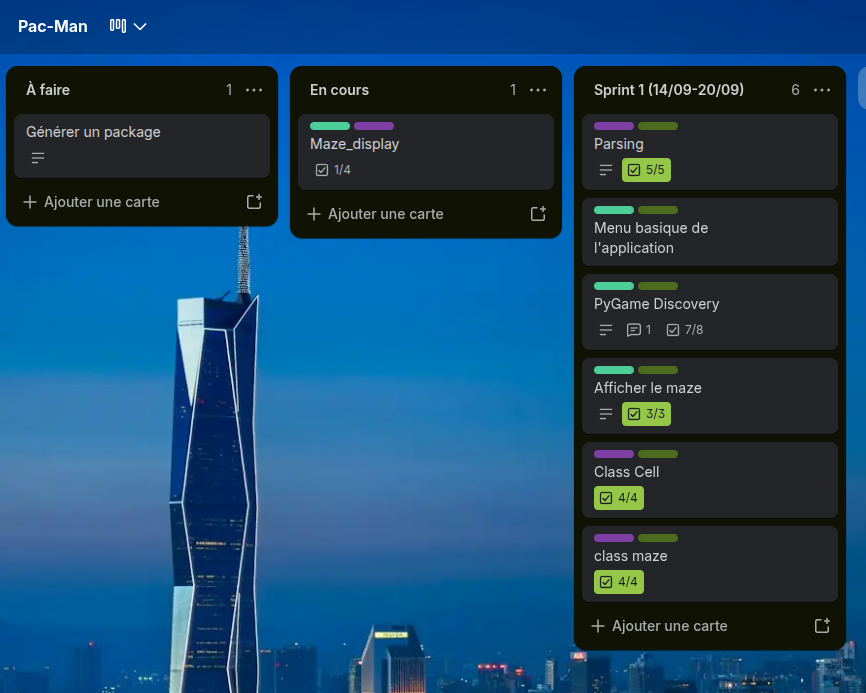
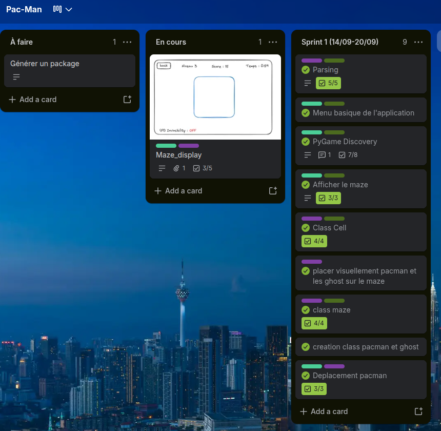
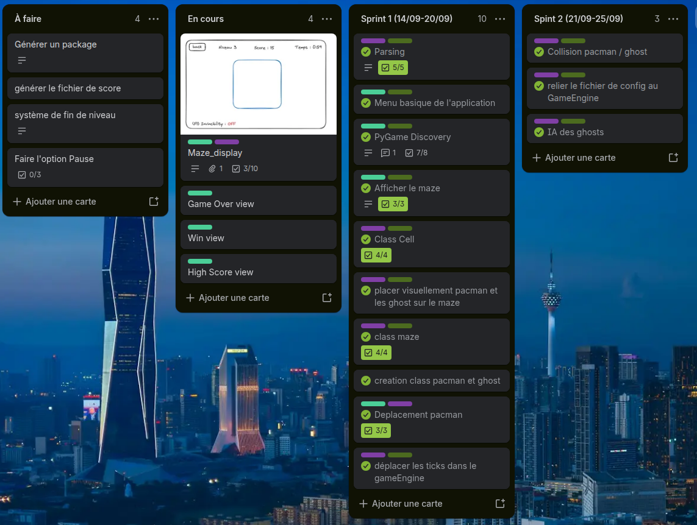
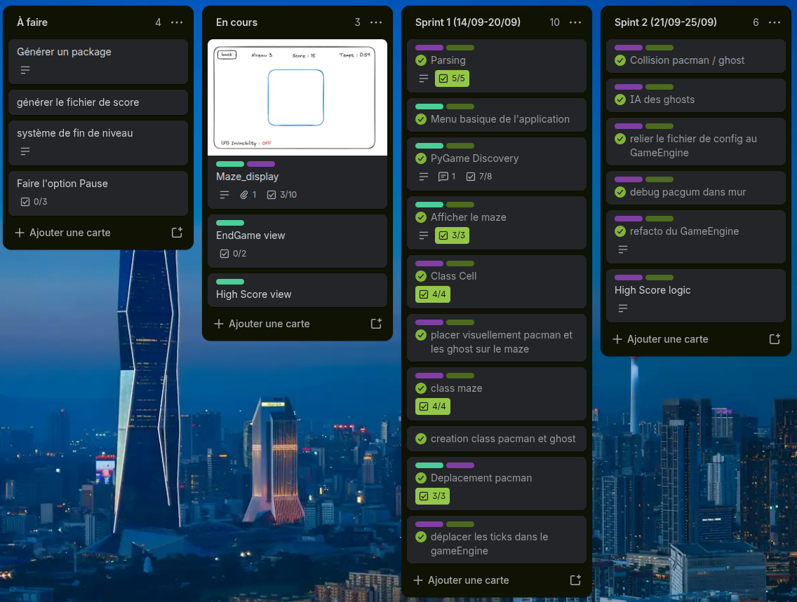
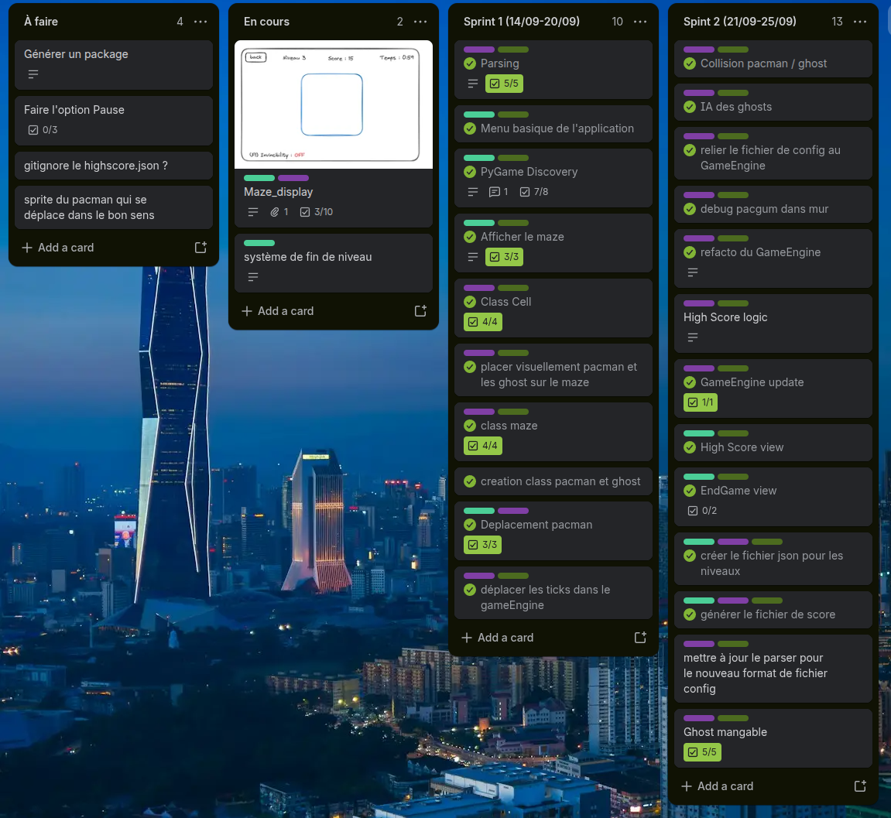
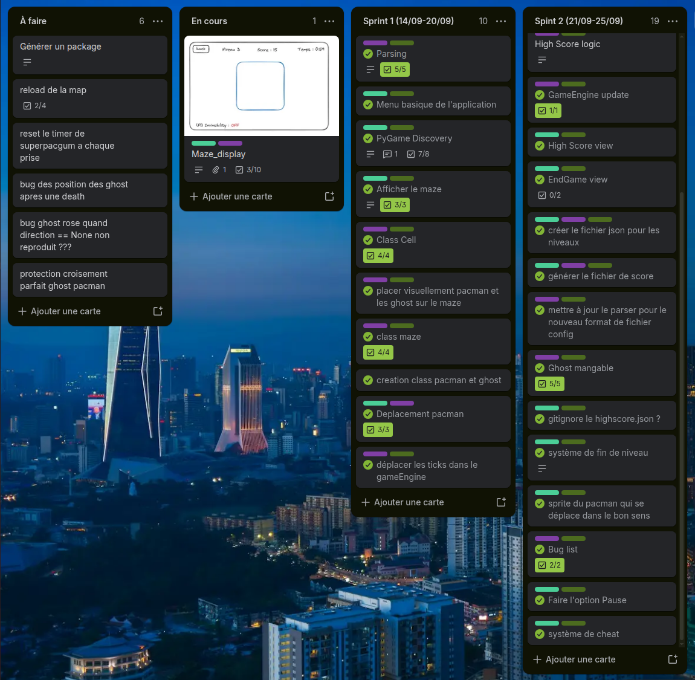
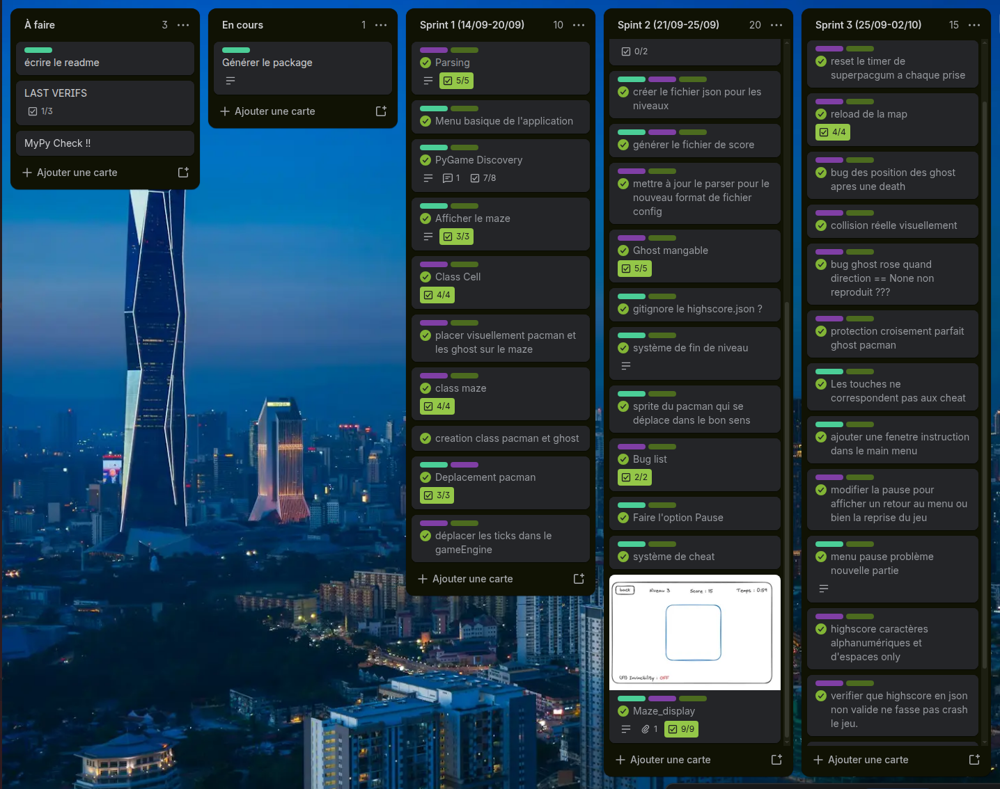
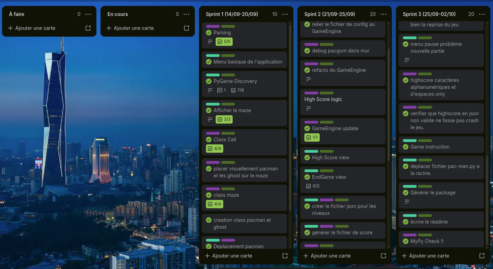

# Project Management

Working as a duo, we adopted an Agile-inspired methodology to ensure smooth collaboration and efficient progress throughout the development of our Pac-Man project. We relied on Trello as our primary tool for task management, closely tracking feature implementations, code refactoring, and bug fixes. To maintain constant synchronization, we established a strict daily routine. Every technical decision and daily milestone is thoroughly documented in our development log, accessible at [devlog.md](devlog.md).

## Development Workflow

To keep our momentum going and ensure transparency, we structured our days around key synchronization points:

*   **Morning Sync:** A daily stand-up meeting to define the day's objectives, discuss potential blockers, and assign Trello tickets effectively.
*   **Evening Wrap-up:** An end-of-day debriefing to evaluate completed tasks, update our devlog, and brainstorm upcoming requirements. This was also the dedicated time to create and organize new tickets for the following day.
*   **Continuous Tracking:** Our Trello board was kept up-to-date in real-time. Tickets were moved as soon as tasks were completed, and new issue tickets were immediately generated whenever a bug or edge case was identified during development.

## GitHub Workflow

Maintaining a clean, stable, and readable codebase was a top priority for our team. We enforced a strict version control policy:

*   **Feature Branching:** Every new feature, enhancement, or bug fix was developed on its own dedicated branch to isolate changes.
*   **Peer Review:** Before any code could be merged into the main development branch, it required a formal **Pull Request (PR)**. This process guaranteed that all code was thoroughly read, tested, and approved by the other team member, which significantly reduced the introduction of new bugs and maintained a high standard of code quality.

## Trello Progression

To illustrate our agile process and daily task tracking, below is a visual timeline of our Trello board's evolution over the course of the project.

---

### Day 2

     
     
     
    
     
     
     

---

### Day 3

     
     
     
    
     
     
     

---

### Day 4

     
     
     
    
     
     
     

---

### Day 5

     
     
     
    
     
     
     

---

### Day 6

     
     
     
    
     
     
     

---

### Day 7

     
     
     
    
     
     
     

---

### Day 8

     
     
     
    
     
     
     

---

### Day 9 - 10 - 11

     
     
     
    
     
     
     

---

### Day 12

     
     
     
    
     
     
     

